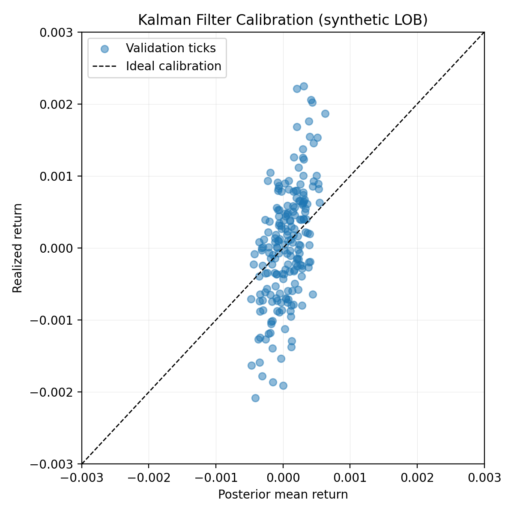

# Model Card: Kalman Filter

## Model Details
- **Model**: Two-state Kalman filter tracking latent price level and short-horizon trend (`src/amie/models/kalman.py`).
- **State Vector**: Level and trend; prediction uses a constant-velocity transition matrix with per-step adaptive covariance inflation for robustness to shocks.
- **Observations**: Log returns from synthetic limit order book ticks; observation noise tuned via `observation_noise` hyperparameter.
- **Version**: `kalman_v0.1`, included in the AMIE registry for pipeline use.
- **Implementation Notes**: Warm-up period seeds the latent states; prediction returns a `Signal` sequence with posterior mean (`score`) and one-sigma uncertainty derived from the trend variance.

## Intended Use
- Short-term return prediction at 1-second cadence for research and prototyping workflows.
- Provides calibrated uncertainty estimates for downstream risk-aware decision logic (e.g., throttling, confidence-weighted positions).
- Designed to run inside the AMIE feature pipeline and benchmarking harness; not optimized for high-frequency production execution.

## Training Data
- **Source**: Synthetic limit order book (LOB) generator (`src/amie/data/sources/synthetic_lob.py`) with deterministic seed=42.
- **Regimes**:
  - Regime A: lower volatility (`σ ≈ 0.0004`), tighter spread (20 bps), unit depth liquidity.
  - Regime B: higher volatility (`σ ≈ 0.0008`), wider spread (35 bps), 20% higher depth.
- **Sampling**: 1-second ticks alternating regimes every 250 observations; bids/asks derived up to depth 3 with geometry-decaying size.
- **Feature Engineering**: Rolling features (log returns, EWMA volatility, z-score, spread, imbalance) computed via `FeatureComputer` (`window_size=20`, `ewma_span=20`).
- **Latest Run**: `run-20251022185618` (see `outputs/2025-10-22/20-56-18/compute_features.log`) producing 1,000 ticks saved to `data/features/run-20251022185618/2024-01-01.parquet`.

## Performance
Validation split: final 20% (200 ticks) of the synthetic feature set. Metrics computed with the in-repo Kalman filter (process_noise=1e-4, observation_noise=1e-2, warmup_period=5).

| Metric | Value | Notes |
| --- | --- | --- |
| RMSE | `7.02e-04` | Root-mean-square error on held-out returns. |
| MAE | `5.60e-04` | Mean absolute error on the same validation slice. |
| Mean uncertainty | `1.91e-03` | Average posterior one-sigma trend uncertainty. |
| Validation ticks | `200` | Portion of the 1,000-tick synthetic run used for scoring. |

Calibration (posterior mean vs. realized return):

Reproduction steps:
1. Ensure the virtual environment is active (`source venv/bin/activate` or prefix commands with `./venv/bin/python`).
2. Generate features if needed (`python scripts/compute_features.py` with matching config) or reuse `data/features/run-20251022185618`.
3. Run `./venv/bin/python scripts/train_model.py` to execute the training pipeline and emit metrics under `results/`.
4. For ad-hoc evaluation, the snippet in `scripts/train_model.py` can be reused to recompute RMSE and produce updated calibration plots.

## Limitations
- Assumes linear state dynamics with Gaussian noise; abrupt regime shifts or heavy-tailed returns may degrade performance.
- Observation model only ingests log returns; structural order book signals (spread, imbalance) are not directly modeled.
- Adaptive inflation heuristics may over-react during prolonged volatility bursts, leading to wider uncertainty bands.

## Ethical Considerations
- Trained solely on synthetic data; no customer or proprietary market data is included.
- Intended for research and internal benchmarking, not direct live-trading deployment.
- Users are responsible for compliance and risk controls before applying outputs to real capital.

## Caveats
- No live market back-testing or paper trading validation has been performed.
- Performance metrics reflect a single synthetic generation; real-world behaviour will differ.
- Downstream systems should treat outputs as experimental until empirically validated on production-quality data.
